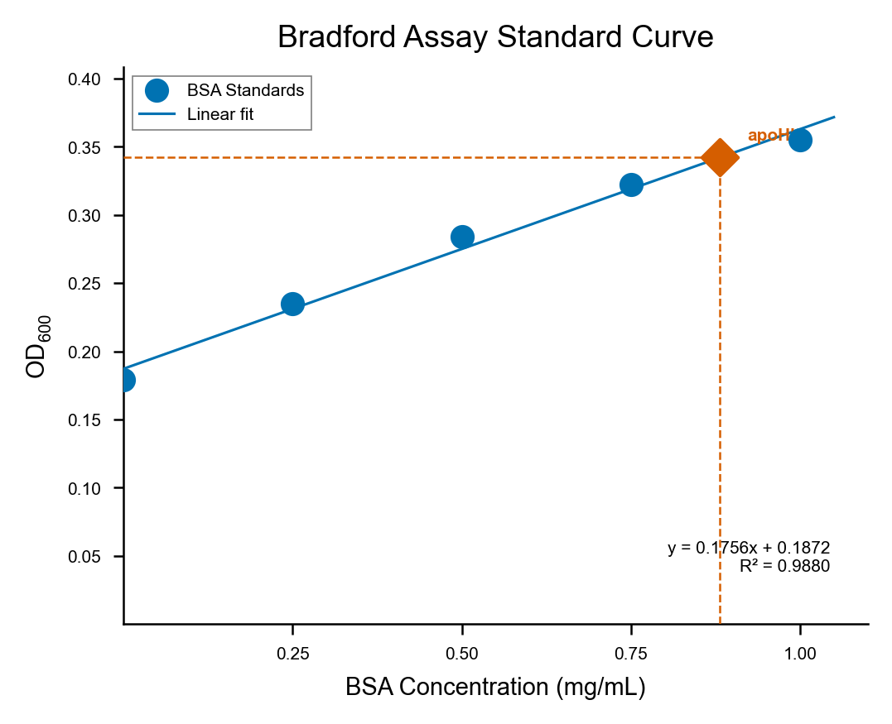
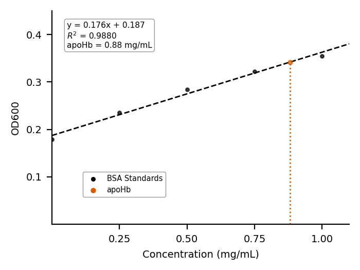

# Bradford Assay Standard Curve — Example

BSA standard curve with linear regression and apoHb unknown sample interpolation, generated by two AI workflows using the same data and comparable prompts.

## Dataset

[`data/Bradford Curves.csv`](data/Bradford%20Curves.csv) — 5 BSA standards + 1 unknown sample, 2 columns (mg/mL, OD600).

| Sample | mg/mL | OD600 |
|--------|-------|-------|
| Standard 1 | 0 | 0.179 |
| Standard 2 | 0.25 | 0.235 |
| Standard 3 | 0.5 | 0.284 |
| Standard 4 | 0.75 | 0.322 |
| Standard 5 | 1.0 | 0.355 |
| Unknown | apoHb | 0.342 |

Pre-calculated interpolation in CSV: 0.8815 mg/mL.

## Starting prompt

Both workflows received the same initial request:

> Make a standard curve from the Bradford Curves csv. 5-point BSA standards, plot concentration vs OD600. Linear regression. Interpolate the apoHb unknown sample. Show dashed lines for the interpolation and mark the intersection point. Display R² and equation. Use Nature-style formatting.

## Iteration summary

Each workflow went through three rounds. The revision requests were similar across workflows, converging on the same final specifications.

| Version | Changes requested |
|---------|-------------------|
| **v1** | Initial figure from the prompt above |
| **v2** | Add title ("Bradford Assay Standard Curve"). Increase markers. Annotate apoHb concentration below drop line. Remove equation box border, move to lower-right. Axis titles to 8 pt. X-ticks at 0.25 intervals. Legend upper-left with gray border |
| **v3** | All fonts −1 pt. Remove zero ticks. Direct bold "apoHb" label on point. Regression line −25%. Dashed lines to 0.6 pt. Legend border to 0.4 pt |

## Final figures

### Claude

Script: [`Claude/figure_v3.py`](Claude/figure_v3.py) | Vector: [`Claude/figure_v3.svg`](Claude/figure_v3.svg)

matplotlib + scipy (no seaborn). Nature single-column sizing (89 mm wide). OLS linear regression, R² ≈ 0.99, interpolated apoHb ≈ 0.882 mg/mL.

---

### Gemini-Gems

Script: [`Gemini-Gems/figure_v3.py`](Gemini-Gems/figure_v3.py)

matplotlib + scipy (no seaborn). Nature single-column sizing (89 mm wide). OLS linear regression, R² ≈ 0.99, interpolated apoHb ≈ 0.882 mg/mL.

## Conversation logs

Full turn-by-turn histories for each workflow:

- **Claude** — [`Claude/conversation_export_bradford.md`](Claude/conversation_export_bradford.md)
- **Gemini-Gems** — [`Gemini-Gems/bradford_conversation_gemini_gems.md`](Gemini-Gems/bradford_conversation_gemini_gems.md)

## Dependencies

All scripts require: `pandas`, `numpy`, `matplotlib`, `scipy`.
