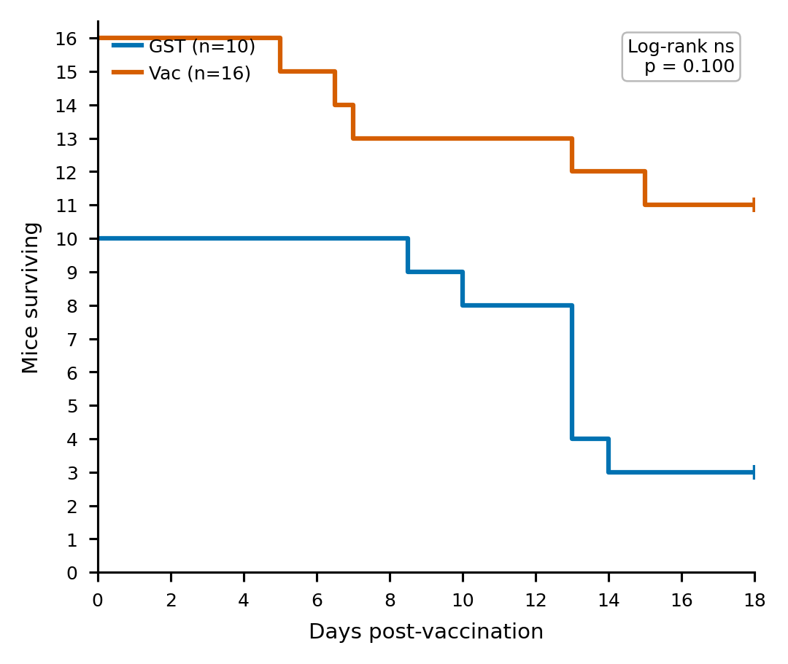
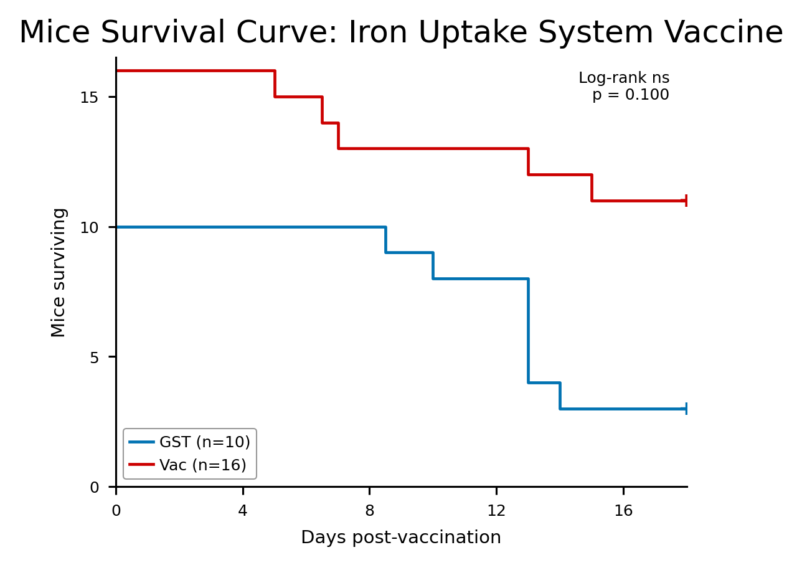
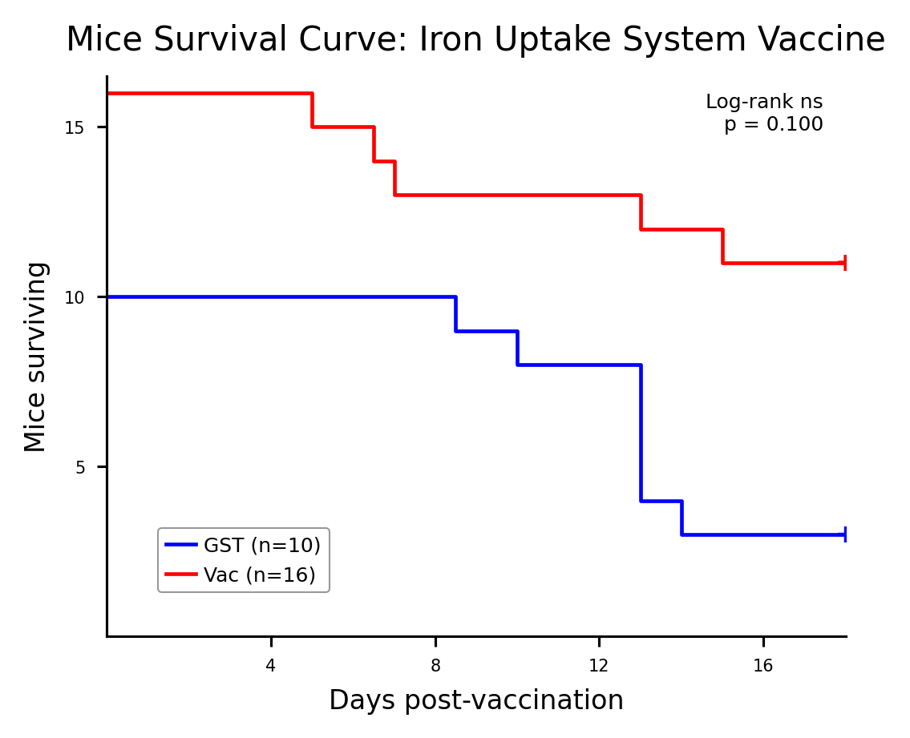

# Conversation Export
**Date:** February 20, 2026
**Topic:** Kaplan-Meier Survival Figure — Joseph Mice Dataset

---

## Turn 1 — User

> Create a figure from Joseph_Mice.csv using SKILL_claude.md. Kaplan-Meier plot. We are looking at survival of two groups of mice (GST and Vac) since receiving vaccine. Time is in days. Event 1 is death, event 2 is survival to the end. x-axis should go from time = 0 to 18. y-axis reflects the number of mice remaining. Statistical test should be Kaplan-Meier estimator. Use Nature-style formatting.

## Turn 1 — Assistant

Read and audited `Joseph_Mice.csv`:
- **Shape:** 26 rows × 3 columns (Time, Event, Treatment)
- **GST:** n = 10 | **Vac:** n = 16
- Event = 1 (death), Event = 0 (censored / survived to day 18)

Generated `figure_v1.py` producing a Kaplan-Meier step plot with:
- Y-axis: number of mice surviving (scaled from KM survival fraction × n)
- X-axis: 0–18 days
- Censored observations marked with `+` tick marks
- Log-rank test: **p = 0.100 (ns)**
- Nature single-column width (89 mm), 300 DPI, Wong colorblind-safe palette, Arial font, despined axes

**Delivered:** `figure_v1.png`, `figure_v1.svg`, `figure_v1.py`

---

## Turn 2 — User

> Carry out following changes:
> * y-axis tick interval should be 5 (0, 5, 10, 15)
> * x-axis tick interval should be 4 (0, 4, 8, 12, 16)
> * Color Vac line as red, GST as blue
> * Move line legend down to lower left corner of the plot
> * Add border around legend — 0.5 line thickness, grey border color
> * Decrease survival curve thickness by 25%
> * Remove border around Log-rank test result
> * Add title "Mice Survival Curve: Iron Uptake System Vaccine". Font size 12, font Arial.

## Turn 2 — Assistant

Applied all eight changes to produce `figure_v2.py`:
- Y-axis ticks: 0, 5, 10, 15
- X-axis ticks: 0, 4, 8, 12, 16
- GST → `#0072B2` (blue), Vac → `#CC0000` (red)
- Legend moved to lower left with grey 0.5 pt border frame
- Curve linewidth reduced 1.5 → 1.125 pt (−25%)
- Log-rank text box border removed
- Title added at 12 pt Arial

**Delivered:** `figure_v2.png`, `figure_v2.svg`, `figure_v2.py`

---

## Turn 3 — User

> Export Python script for Figure v2

## Turn 3 — Assistant

Delivered `figure_v2.py` for download.

---

## Turn 4 — User

> Carry out more changes:
> * Decrease title font size to 10
> * Increase separation between title and plot by 30%
> * Set Vac to #FF0000, GST to #0000FF
> * Move legend up and right so that lower left corner should correspond to 1 day / 1 mouse spot
> * Set log-rank text font size to 6
> * Set legend font size to 6
> * Set x- and y-axis ticks to font size 5
> * Set x- and y-axis titles to font size 8
> * Remove ticks at x=0 and y=0

## Turn 4 — Assistant

Applied all nine changes to produce `figure_v3.py`:
- Title font size: 12 → 10 pt
- Title padding: 6 → 7.8 pt (+30%)
- GST → `#0000FF` (pure blue), Vac → `#FF0000` (pure red)
- Legend lower-left corner anchored to data coordinate (1 day, 1 mouse)
- Log-rank text font size: confirmed at 6 pt
- Legend font size: confirmed at 6 pt
- Tick label font size: 6 → 5 pt (both axes)
- Axis title font size: 7 → 8 pt (both axes)
- Zero ticks removed: x starts at 4, y starts at 5

**Delivered:** `figure_v3.png`, `figure_v3.svg`, `figure_v3.py`

---

## Turn 5 — User

> Export Python script for v3

## Turn 5 — Assistant

Delivered `figure_v3.py` for download.

---

## Turn 6 — User

> Export this conversation history. Markdown format preferred.

## Turn 6 — Assistant

Generated and delivered `conversation_export.md` (this file).

---

## File Summary

| File | Description |
|------|-------------|
| `Joseph_Mice.csv` | Raw data — 26 mice, Time/Event/Treatment columns |
| `figure_v1.py` | Initial KM figure script |
| `figure_v1.png` / `.svg` | Initial figure output |
| `figure_v2.py` | After tick intervals, colors, legend, title, line width edits |
| `figure_v2.png` / `.svg` | v2 figure output |
| `figure_v3.py` | After font size, legend position, color, zero-tick edits |
| `figure_v3.png` / `.svg` | v3 figure output |
| `conversation_export.md` | This file |

---

## Statistical Note

The log-rank test (p = 0.100) did not reach conventional significance (α = 0.05). The Vac group showed higher survival (11/16 survived to day 18 vs. 3/10 for GST), but sample sizes limit statistical power. One GST observation was censored at day 8.5 — verify this is correctly coded in the source data.
