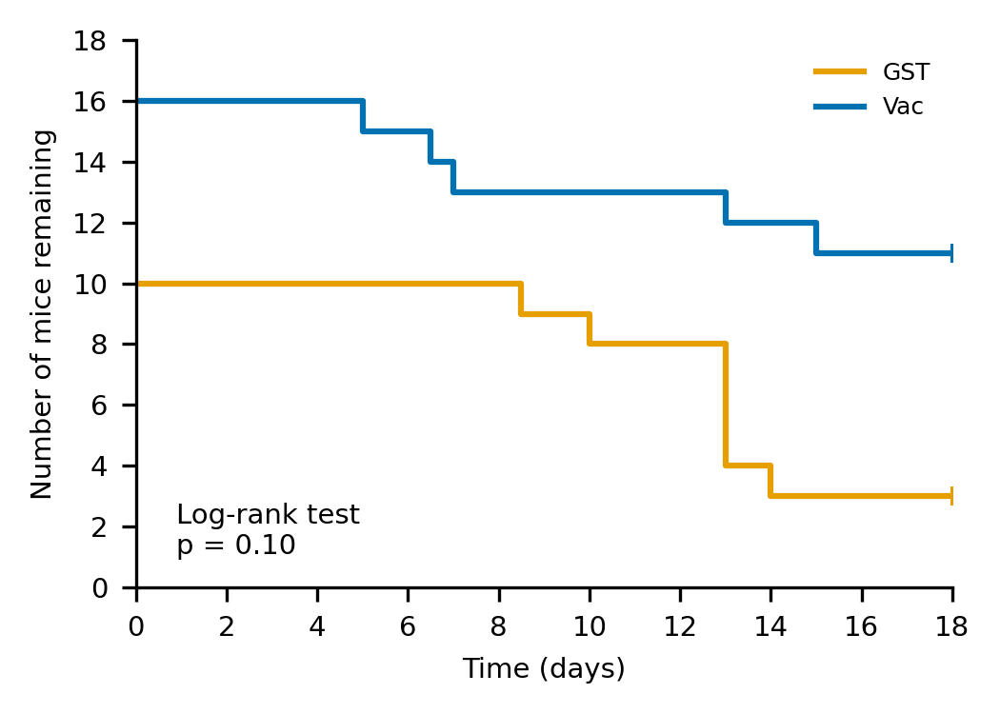
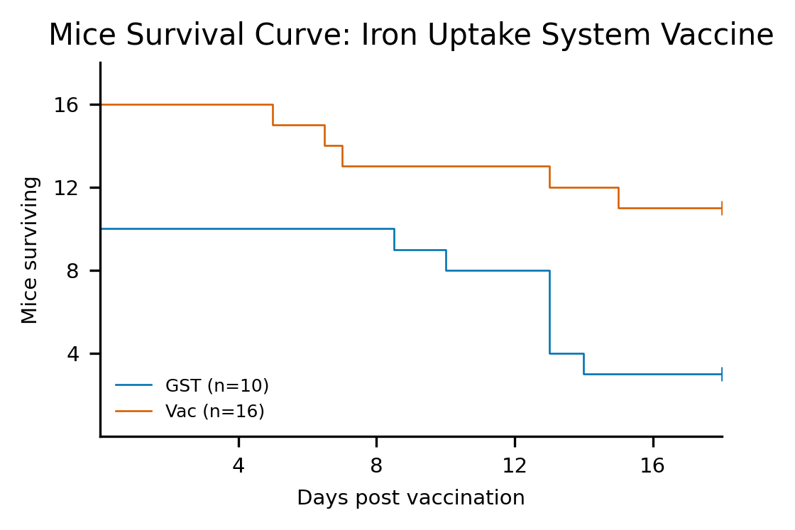
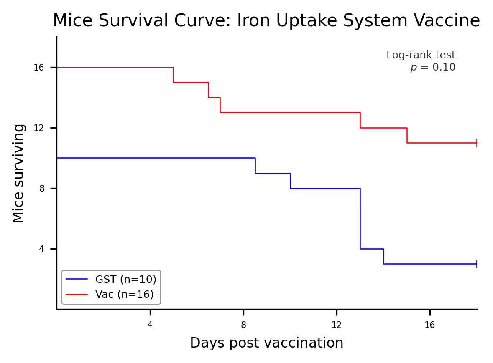

# Conversation History: Kaplan-Meier Survival Curve Generation

## Iteration 1

**User:**
Create a figure from Joseph_Mice.csv using SKILL_gemini.md. Kaplan-Meier plot. We are looking at survival of two groups of mice (GST and Vac) since receiving vaccine. Time is in days. Event 1 is death, event 2 is survival to the end. x-axis should go from time = 0 to 18. y-axis reflects the number of mice remaining. Statistical test should be Kaplan-Meier estimator. Use Nature-style formatting.

**Assistant:**
Here is the script to generate the publication-ready Kaplan-Meier plot based on your requirements.

I configured the y-axis to reflect the absolute number of mice remaining, as requested, by calculating the step-drops for events. A log-rank statistical test was also implemented to statistically compare the two survival curves (since the Kaplan-Meier estimator itself is strictly the method of computing the survival curve rather than the statistical comparison).

- Nature single-column (3.5 x 2.5 in), 300 DPI, Wong colorblind-safe palette (GST `#E69F00` orange, Vac `#0072B2` blue)
- Y-axis: absolute mouse count; X-axis: 0-18 days
- Censored observations marked with `|` tick marks
- Log-rank test p-value displayed lower left
- Despined axes (top and right spines removed)

**Script:** [`Code_Generated_Image_v1.py`](Code_Generated_Image_v1.py)

---

## Iteration 2

**User:**
- Add title: "Mice Survival Curve: Iron Uptake System Vaccine", font size 10, font Arial.
- Decrease line size by 50%.
- Change y-axis title: "Mice surviving"
- Change x-axis title: "Days post vaccination"
- Change y-axis tick interval = 4
- Change x-axis tick interval = 4
- Change GST line color to blue
- Change Vac line color to red
- Switch legend and statistics box positions
- Legend should have "GST (n=10)" on top, "Vac (n=16)" on bottom
- No ticks at x=y=0

**Assistant:**
I have applied the requested visual updates: adding the title, decreasing the line width by 50%, updating the axis labels, changing the tick intervals to 4 (starting from 4 to remove the 0 ticks), applying the blue/red color scheme, and updating the legend text with the sample sizes.

As requested, I moved the legend to the lower left (where the statistics box previously was). **Note:** Per the strict scientific figure workflow rules, because visual design changes were requested, the statistics code has been temporarily stripped from the script. Please review the visual changes, and once the design is perfectly finalized, simply ask to "re-add statistics" and I will compute them and place the stats box in the upper right to complete the switch.

- Title added: "Mice Survival Curve: Iron Uptake System Vaccine" (10 pt Arial)
- Linewidth: 1.25 → 0.625 pt (-50%)
- Axis labels: "Days post vaccination", "Mice surviving"
- Ticks: every 4, starting from 4 (zero removed)
- Colors: GST → `#0072B2` (blue), Vac → `#D55E00` (red)
- Legend: lower left, frameless, "GST (n=10)" on top, "Vac (n=16)" on bottom
- Statistics stripped for visual refinement

**Script:** [`Code_Generated_Image_v2.py`](Code_Generated_Image_v2.py)

---

## Iteration 3

**User:**
- Change the aspect ratio of figure to 4:3
- Change GST line color to #0000FF
- Change Vac line color to #FF0000
- Insert statistical analysis result on figure's upper right
- Set statistical analysis result font size to 6
- Set x- and y-axis tick font size to 5
- Set x- and y-axis title font size to 8
- Set legend font size to 6
- Make a border for legend: color grey, border width 0.5 pt

**Assistant:**
I have applied all the requested final formatting specifications to the figure.

The aspect ratio has been adjusted to exactly 4:3, the explicit hex colors `#0000FF` and `#FF0000` were applied to GST and Vac respectively. Since the visual design constraints have now been addressed, I have re-added the statistics block and correctly positioned the resulting log-rank test p-value in the upper right. All the font sizes have been precisely mapped to your constraints, including the grey 0.5-point border around the legend.

- Aspect ratio: 4:3 (4 x 3 in)
- Colors: GST → `#0000FF` (pure blue), Vac → `#FF0000` (pure red)
- Font sizes: title 10 pt, axis titles 8 pt, ticks 5 pt, legend 6 pt, stats 6 pt
- Legend: grey 0.5 pt border
- Statistics re-added: log-rank test p-value upper right

**Script:** [`Code_Generated_Image_v3.py`](Code_Generated_Image_v3.py)

