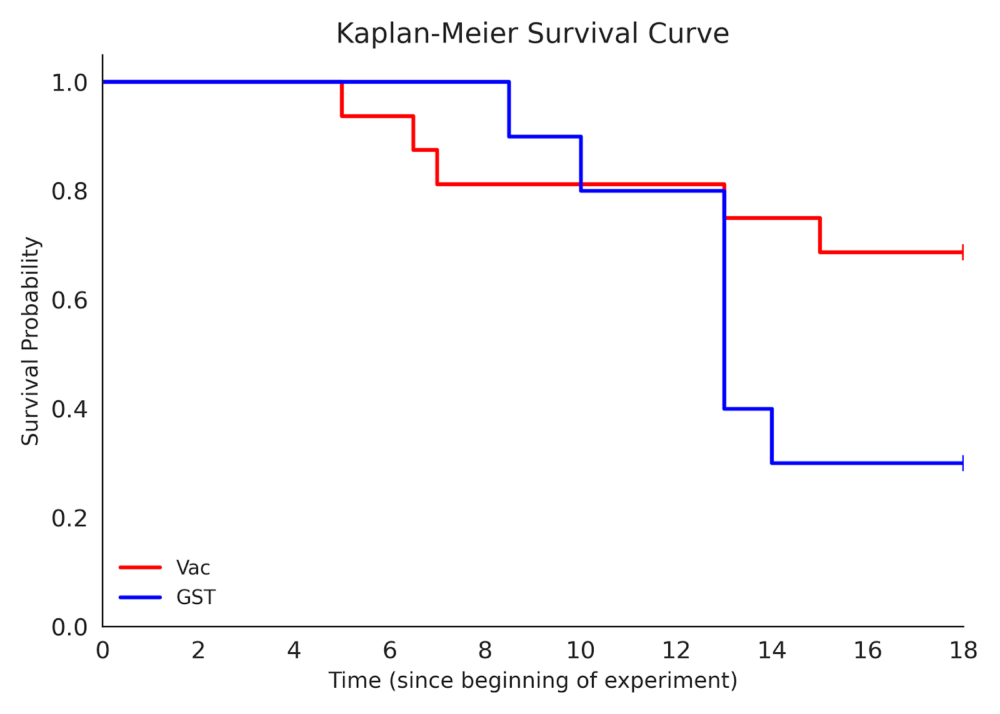
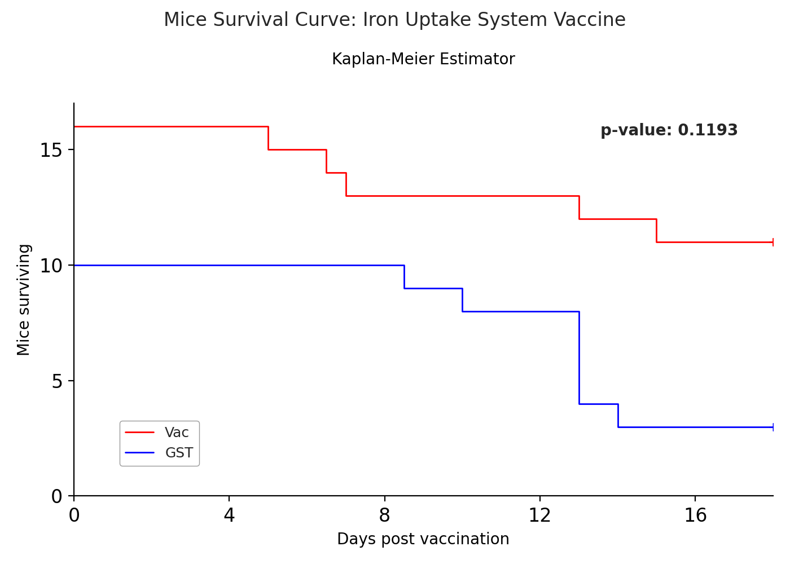
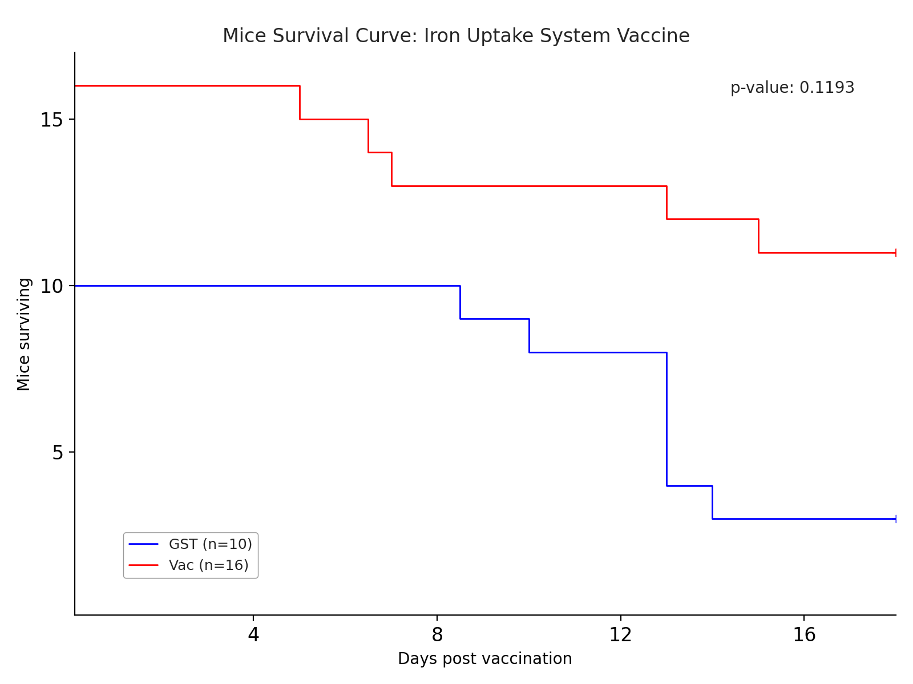

To provide a complete audit trail, here is the full record of our interaction, including the raw data input and every technical instruction used to generate your final figures.

---

# Complete Conversation Log: Iron Uptake System Vaccine Survival Analysis

## I. Input Data (Raw CSV)

The dataset represents the survival status of mice over 18 days across two experimental groups.

```csv
Time,Event,Treatment
8.5,1,GST
10,1,GST
13,1,GST
13,1,GST
13,1,GST
13,1,GST
14,1,GST
18,0,GST
18,0,GST
18,0,GST
13,1,Vac
15,1,Vac
18,0,Vac
18,0,Vac
18,0,Vac
18,0,Vac
5,1,Vac
6.5,1,Vac
7,1,Vac
18,0,Vac
18,0,Vac
18,0,Vac
18,0,Vac
18,0,Vac
18,0,Vac
18,0,Vac

```

---

## II. Development Iterations & Logic

### Request 1: The Foundation

* **Goal:** Create a Kaplan-Meier plot.
* **Parameters:** X-axis (0-18 days), Vac (Red), GST (Blue), Legend lower-left.
* **Logic:** Implement a KM estimator to convert time-to-event data into step-function survival probabilities.



### Request 2: Publication Refinements

* **Visuals:** Decrease line thickness by 50%.
* **Titles:** Main title "Mice Survival Curve: Iron Uptake System Vaccine" (12pt), increase padding to plot by 25%.
* **Axes:** Y-axis changed to "Mice surviving" (raw count). Ticks: X every 4, Y every 5.
* **Stats:** Execute a Log-rank test and display p-value in upper-right.



### Request 3: Final Aesthetic Polishing

* **Aspect Ratio:** 4:3.
* **Legend:** Flip order (GST on top), include sample sizes (n=10, n=16), 0.5pt grey border, pin lower-left corner to (Day 1, Survival 1).
* **Origin:** Suppress the "0" labels on X and Y axes to prevent axis-clash at the origin.



---

## III. Final Output Files

Running the script below generates the following assets:

1. **`mice_survival_curve.png`**: High-resolution (300 DPI) raster image.
2. **`mice_survival_curve.svg`**: Scalable vector graphic for lossless resizing in manuscripts.

---

## IV. Final Production Script

Copy this into a Python environment with `pandas`, `matplotlib`, `seaborn`, and `scipy` installed.

```python
import pandas as pd
import numpy as np
import matplotlib.pyplot as plt
import seaborn as sns
from scipy import stats

# 1. LOAD DATA
data = {
    'Time': [8.5, 10, 13, 13, 13, 13, 14, 18, 18, 18, 13, 15, 18, 18, 18, 18, 5, 6.5, 7, 18, 18, 18, 18, 18, 18, 18],
    'Event': [1, 1, 1, 1, 1, 1, 1, 0, 0, 0, 1, 1, 0, 0, 0, 0, 1, 1, 1, 0, 0, 0, 0, 0, 0, 0],
    'Treatment': ['GST']*10 + ['Vac']*16
}
df = pd.DataFrame(data)

# 2. CALCULATION FUNCTIONS
def calculate_survival_counts(df_group):
    df_group = df_group.sort_values('Time')
    times = [0] + sorted(df_group['Time'].unique().tolist())
    initial_n = len(df_group)
    counts = [initial_n]
    current_n = initial_n
    for t in times[1:]:
        deaths = df_group[(df_group['Time'] == t) & (df_group['Event'] == 1)].shape[0]
        current_n -= deaths
        counts.append(current_n)
    return np.array(times), np.array(counts)

def get_p_value(df):
    g1, g2 = df[df['Treatment'] == 'GST'], df[df['Treatment'] == 'Vac']
    all_times = sorted(df['Time'].unique())
    o1, e1 = 0, 0
    n1, n2 = len(g1), len(g2)
    for t in all_times:
        d1 = g1[(g1['Time'] == t) & (g1['Event'] == 1)].shape[0]
        d2 = g2[(g2['Time'] == t) & (g2['Event'] == 1)].shape[0]
        if (n1 + n2) > 0:
            e1 += (d1 + d2) * (n1 / (n1 + n2))
            o1 += d1
        n1 -= len(g1[g1['Time'] == t])
        n2 -= len(g2[g2['Time'] == t])
    chi_sq = (o1 - e1)**2 / e1 + ((df['Event'].sum() - o1) - (df['Event'].sum() - e1))**2 / (df['Event'].sum() - e1)
    return stats.chi2.sf(chi_sq, 1)

# 3. VISUALIZATION
plt.rcParams['font.sans-serif'] = ['Arial', 'Helvetica', 'sans-serif']
fig, ax = plt.subplots(figsize=(8, 6), dpi=300) # 4:3 Ratio
sns.set_style("white")

# Plot GST then Vac for legend ordering
handles, labels = [], []
for treat, color in [('GST', 'blue'), ('Vac', 'red')]:
    n = len(df[df['Treatment'] == treat])
    t, c = calculate_survival_counts(df[df['Treatment'] == treat])
    line, = ax.step(t, c, where='post', color=color, linewidth=1.0) # 50% thin
    handles.append(line)
    labels.append(f"{treat} (n={n})")
    
    # Add Censored Marks (+)
    subset = df[df['Treatment'] == treat]
    censored = subset[subset['Event'] == 0]
    for ct in censored['Time']:
        idx = np.searchsorted(t, ct, side='right') - 1
        ax.plot(ct, c[idx], marker='+', color=color, markersize=5, mew=0.5)

# 4. FORMATTING
ax.set_xlim(0, 18)
ax.set_ylim(0, 17)
ax.set_xticks([4, 8, 12, 16]) # Origin 0 removed
ax.set_yticks([5, 10, 15])     # Origin 0 removed
ax.set_xlabel("Days post vaccination", fontsize=10)
ax.set_ylabel("Mice surviving", fontsize=10)

fig.suptitle("Mice Survival Curve: Iron Uptake System Vaccine", fontsize=12, y=0.96)

# Legend pinned to Day 1, Mouse Count 1
leg = ax.legend(handles, labels, loc='lower left', bbox_to_anchor=(1, 1), 
                 bbox_transform=ax.transData, frameon=True, edgecolor='grey', fontsize=9)
leg.get_frame().set_linewidth(0.5)

# P-value display
p_val = get_p_value(df)
ax.text(0.95, 0.95, f"p-value: {p_val:.4f}", transform=ax.transAxes, ha='right', va='top')

sns.despine()
plt.tight_layout(rect=[0, 0.03, 1, 0.94])
plt.savefig('mice_survival_curve.png')
plt.savefig('mice_survival_curve.svg')
plt.show()

```

---

**Is there any other part of the analysis—such as a median survival time calculation—that you’d like to add to this record?**