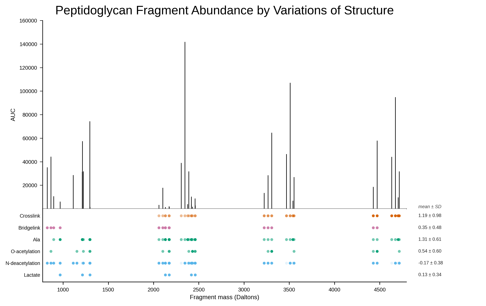

# Peptidoglycan Mass Spectrometry — Example

Hybrid bar chart / dot heatmap of peptidoglycan fragment abundance and structural variants, generated by Claude.

## Dataset

[`data/test_mass_spec.csv`](data/test_mass_spec.csv) — 52 peptidoglycan fragments, 8 columns.

| Column | Description |
|--------|-------------|
| mass | Fragment mass in Daltons |
| Crosslink | Structural variant count |
| Bridgelink | Structural variant count |
| Ala | Structural variant count |
| O-acetylation | Structural variant count |
| N-deacetylation | Structural variant count |
| Lactate | Structural variant count |
| AUC | Area under curve (signal abundance) |

Mass range: ~824–4703 Da. AUC range: ~300–143,670. For duplicate mass values, only the row with the highest AUC is retained.

## Starting prompt

> Create a hybrid bar plot / heatmap from the uploaded data with uploaded figure sketch as the template. Note that x-axis (mass) should be attached to y-axis (AUC) at minimum values. Very small size for dots in categorical values with color transparency gradient by values (minmax normalized for each category). Provide mean and standard deviation for each category on the right of each category.

## Iteration summary

| Version | Changes requested |
|---------|-------------------|
| **v1** | Initial figure from the prompt above |
| **v2** | Move x-axis to y=0. Deduplicate by keeping highest AUC per mass. Narrow bars to black stem lines. x-axis title to "Fragment mass (Daltons)" |
| **v3** | Decrease dot size by 25%. Add title "Peptidoglycan Fragment Abundance by Variations of Structure" at 2× axis title size. Font Arial. Remove y=0 tick |

## Final figure

### Claude

Script: [`Claude/figure_v3.py`](Claude/figure_v3.py) | Vector: [`Claude/mass_spec_figure_v3.svg`](Claude/mass_spec_figure_v3.svg)

matplotlib only (no seaborn). Two-panel layout: AUC stem lines (top) and dot heatmap with opacity encoding (bottom), shared x-axis. Mean ± SD sidebar. Wong colorblind-safe palette.

## Conversation log

- **Claude** — [`Claude/figure_audit.md`](Claude/figure_audit.md)

## Dependencies

All scripts require: `pandas`, `numpy`, `matplotlib`.
