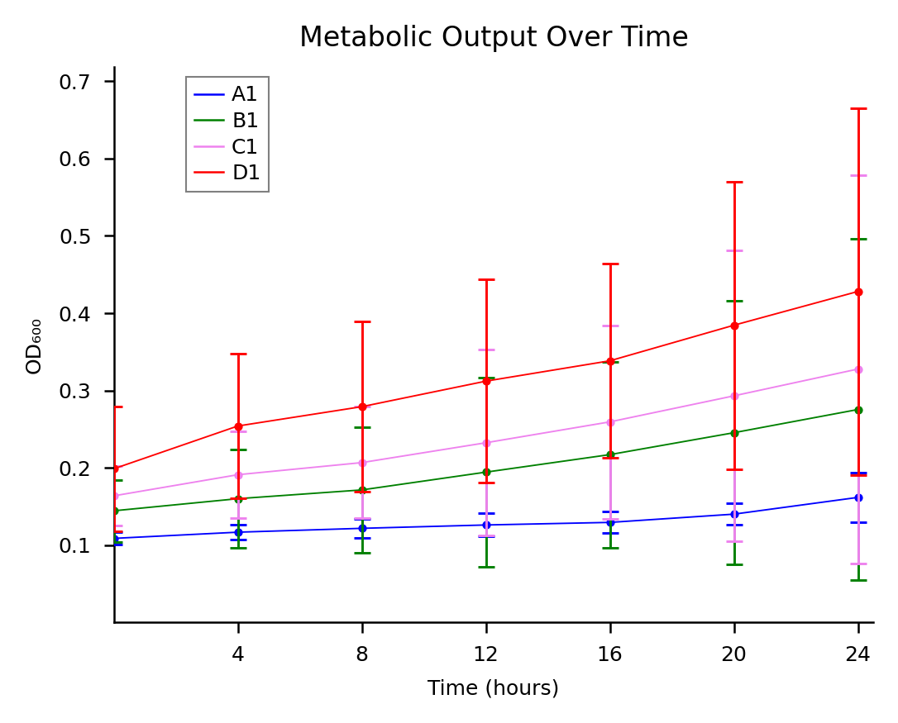
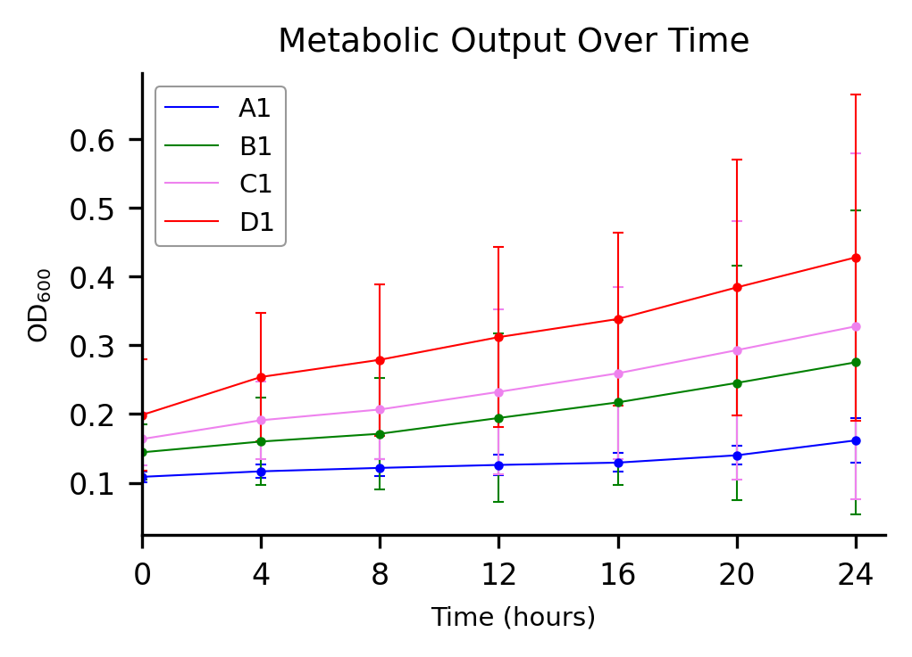

# Growth Curve Time Series — Example

Time series plot of plate reader OD600 data with 95% CI error bars, generated by two AI workflows using the same data and comparable prompts.

## Dataset

[`data/plate_growth_curve.csv`](data/plate_growth_curve.csv) — 98 timepoints (0–24 h, 15-min intervals), 4 series × 3 replicates, 13 columns.

| Series | Replicates | Description |
|--------|------------|-------------|
| A1 | 3 | Condition A |
| B1 | 3 | Condition B |
| C1 | 3 | Condition C |
| D1 | 3 | Condition D |

Values are OD600 absorbance readings (range 0.106–0.525). Only 4-hour multiples (0, 4, 8 … 24) are plotted in the final figures.

## Starting prompts

Claude and Gemini-Gems received similar but not identical initial requests. Claude started with black lines at 2-hour intervals (switched to colored 4-hour in v2); Gemini-Gems started with colored lines at 4-hour intervals.

**Claude:**

> Make a time series plot from the csv file. There are four time series (A1, B1, C1, D1) with three repeats. Only plot times at multiples of two (0, 2, 4... 24). Connect timepoints. Color for all four series is black. Draw error bars- t-test. Use Nature-style formatting.

**Gemini-Gems:**

> Make a time series plot from the csv file. There are four time series (A1, B1, C1, D1) with three repeats. Only plot times at multiples of four (0, 4, 8... 24). Connect timepoints. Colors for four series: A1: blue, B1: green, C1: violet, D1: red. Draw error bars- t-test. X-axis title is "Time (hours)". Axis titles at font size 8. Add title: "Metabolic Output Over Time", font size 10. x- and y-axis ticks at font size 8. Use Nature-style formatting.

## Iteration summary

Each workflow converged on the same final specifications through iterative refinement.

### Claude (4 versions)

| Version | Changes requested |
|---------|-------------------|
| **v1** | Initial figure from the prompt above |
| **v2** | 4-hour intervals. Per-series colors (blue, green, violet, red). Closed circles. Title "Metabolic Output Over Time" (10 pt). Axis titles 8 pt. No zero ticks. Remove error bar legend note |
| **v3** | Dot size −50%. Legend repositioned to x = 2 h. Hex colors (#0000FF, #008000, #EE82EE, #FF0000). All fonts −2 pt. Legend as colored lines only with gray border |
| **v4** | Legend font +2 pt. Legend border −50%. Plot line width −50% |

### Gemini-Gems (3 versions)

| Version | Changes requested |
|---------|-------------------|
| **v1** | Initial figure from the prompt above |
| **v2** | Y-axis label to OD600 (subscript). Simplified legend (lines only, gray border). Marker size −50%. Line width −50%. Font sizes −1 pt |
| **v3** | x = 0 intersects y-axis. Restore error bars |

## Final figures

### Claude

Script: [`Claude/figure_v4.py`](Claude/figure_v4.py)

matplotlib + scipy. Nature single-column sizing (89 mm wide). 95% CI error bars (t-distribution, n = 3, df = 2).

---

### Gemini-Gems

Script: [`Gemini-Gems/iteration-3.py`](Gemini-Gems/iteration-3.py)

matplotlib + scipy. Nature single-column sizing (89 mm wide). 95% CI error bars (t-distribution, n = 3, df = 2).

## Conversation logs

Full turn-by-turn histories for each workflow:

- **Claude** — [`Claude/conversation_export_growth_curve.md`](Claude/conversation_export_growth_curve.md)
- **Gemini-Gems** — [`Gemini-Gems/conversation_export_growth_curve.md`](Gemini-Gems/conversation_export_growth_curve.md)

## Dependencies

All scripts require: `pandas`, `numpy`, `matplotlib`, `scipy`.
