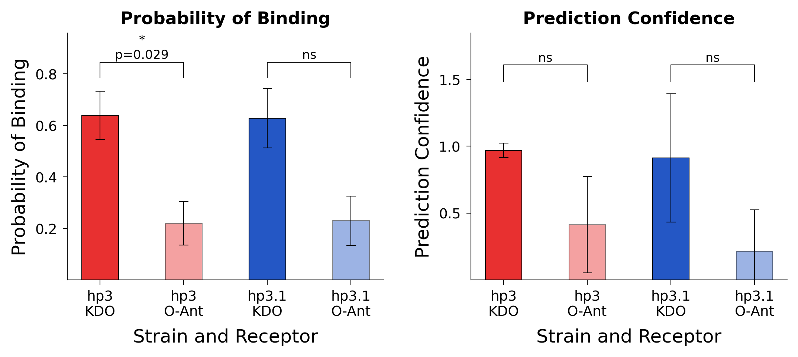

# Bar Graph — Example

Grouped bar charts of results from Boltz-2 protein–receptor binding predictions with t-test significance brackets, generated by Claude.

## Dataset

[`data/boltz_hp3.csv`](data/boltz_hp3.csv) — 24 rows, 3 columns (Sample, Type, Value).

| Sample | Type | n |
|--------|------|---|
| hp3 kdo3 | pred_prob, pred_value | 3 each |
| hp3 o-ant | pred_prob, pred_value | 3 each |
| hp3.1 kdo3 | pred_prob, pred_value | 3 each |
| hp3.1 o-ant | pred_prob, pred_value | 3 each |

Two metrics per sample: `pred_prob` (Probability of Binding) and `pred_value` (Prediction Confidence). Three replicates per condition.

## Starting prompt

> Make me bar graphs. One bar graph is for pred_prob, other for pred_value. Use the term "Probability of Binding" for pred_prob, "Prediction Confidence" for pred_value — both for y-axis and figure title. Error bars. I need t-test comparison done for p-values for three pairs for each bar graph: hp3 kdo/hp3 o-ant, hp3.1 kdo/hp3.1 o-ant, and hp3/hp3.1. Use aspect ratio of 2:3 for each figure. x-axis title should be "Strain and Receptor". Plain colors for bar — red for hp3, blue for hp3.1. 0.5 pt thickness for error bar and bar border (black). Use Cell-style figure schema.

## Iteration summary

| Version | Changes requested |
|---------|-------------------|
| **v1** | Initial figure from the prompt above |
| **v2** | Group by strain instead of receptor. T-test only between KDO/O-Ant. Increase tick font +1, axis title font +2. Remove y=0 tick. Prediction Confidence y-axis starts at 0. Legend font +2 |
| **v3** | Remove legends; use descriptive x-tick labels. Tick font +2, axis titles +3. Y-axis intervals: 0.2 (Probability of Binding), 0.5 (Prediction Confidence) |
| **v4** | Title font 11 pt. Bar width +25%. Show p-value alongside significance stars. Aspect ratio changed to 1:1 |

## Final figure

### Claude

Script: [`Claude/figure_v4.py`](Claude/figure_v4.py) | Vector: [`Claude/figure_v4.svg`](Claude/figure_v4.svg)

matplotlib only. Two-panel layout (Probability of Binding, Prediction Confidence). Cell Press single-column schema, 1:1 aspect ratio per panel. Red (hp3) / blue (hp3.1) bars with SEM error bars and Welch's t-test significance brackets showing stars + p-values.

## Conversation log

- **Claude** — [`Claude/conversation_export.md`](Claude/conversation_export.md)

## Dependencies

All scripts require: `pandas`, `numpy`, `matplotlib`, `scipy`.
