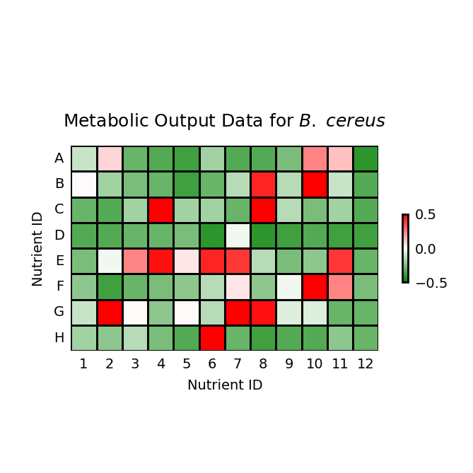

# Biolog Heatmap — Example

Metabolic output heatmap for *B. cereus* with Z-score normalization and Cell journal formatting, generated by Gemini-Gems.

## Dataset

[`data/biolog_output.csv`](data/biolog_output.csv) — 96-well plate layout (8 rows × 12 columns), optical density measurements.

| | 1 | 2 | 3 | … | 12 |
|---|---|---|---|---|---|
| A | 0.096 | 0.101 | 0.091 | … | 0.088 |
| B | 0.099 | 0.094 | 0.092 | … | 0.090 |
| … | … | … | … | … | … |
| H | 0.094 | 0.093 | 0.095 | … | 0.091 |

Values range from 0.088 to 0.338 (notable outlier at F10). Global Z-score standardization applied for visualization.

## Starting prompt

> Make a heatmap from this table. Color scale should be green (lowest) to white to red (highest). Use normal standardization for color scale. Use Cell's journal figure style. Figure title is 'Metabolic Output Data for B. cereus' (B. cereus in italic), font arial, font size 9. No numbers inside the cell. Cells should be square in size. Very thin (1 point) border around each cell. Place scale on the right side- for height, 1/3 the size of the main heatmap, aspect ratio 1:12. 1 point border around the scale. Labels: no border around text, white background. For x and y axis labels, font arial, font size 7.

## Iteration summary

| Version | Changes requested |
|---------|-------------------|
| **v1** | Initial figure from the prompt above |
| **v2** | Change color scale to fixed −0.5 to 0.5. Remove tick marks. Upright tick labels. Axis titles to "Nutrient ID" |
| **v3** | Decrease cell border by 50%. Reduce spacing in "B. cereus" by 30%. Scale font size −50%. Short dash for negative sign. Scale border −50% |

## Final figure

### Gemini-Gems

Script: [`Gemini-Gems/heatmap-3.py`](Gemini-Gems/heatmap-3.py)

matplotlib + seaborn. Cell single-column sizing (85 mm wide). Custom green–white–red diverging colormap. Z-score normalization with fixed ±0.5 bounds.

## Conversation log

- **Gemini-Gems** — [`Gemini-Gems/heatmap_final_summary.md`](Gemini-Gems/heatmap_final_summary.md)

## Dependencies

All scripts require: `pandas`, `numpy`, `matplotlib`, `seaborn`.
